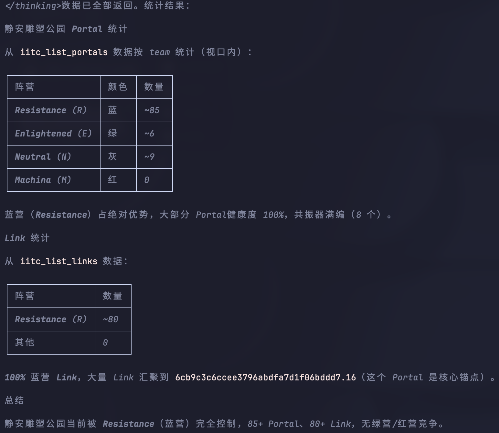
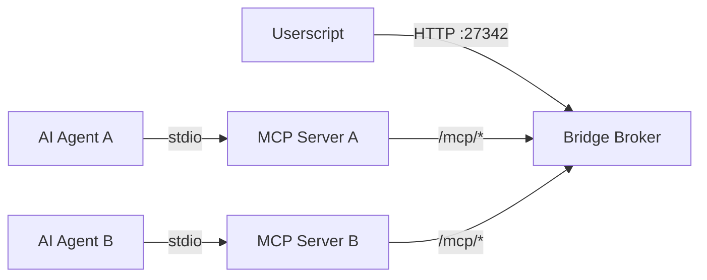

# IITC MCP

**[English](README.md)** | **[中文](README_zh.md)**

将 [IITC（Ingress Intel Total Conversion）](https://github.com/IITC-CE/ingress-intel-total-conversion) 浏览器标签页暴露为 [MCP（Model Context Protocol）](https://modelcontextprotocol.io/) 服务器的双模块桥接工具。AI 代理和 MCP 兼容客户端可以读取地图状态、导航视口、搜索 Portal、收发 COMM、兑换 passcode——全部通过本地回环桥接完成。


## 快速开始

### 1. 安装 Userscript

先装好 [IITC](https://iitc.app/)，然后用 Tampermonkey 安装 iitc-mcp 脚本：

```
https://github.com/comicchang/iitc-mcp/releases/latest/download/iitc-mcp.user.js
```

### 2. 给 Agent 配置 MCP Server

CLI 入口：

```bash
npx github:comicchang/iitc-mcp serve
```

加 `--read-only` 启动只读模式（14 个工具，不注册 `iitc_send_comm` 和 `iitc_redeem_code`）：

```bash
npx github:comicchang/iitc-mcp serve --read-only
```


**Codex**（`~/.codex/config.toml` 或项目级 `.codex/config.toml`）：

```toml
[mcp_servers.iitc-mcp]
command = "npx"
args = ["github:comicchang/iitc-mcp", "serve"]
```

**OpenCode**（`~/.openCode/mcp.json` 或项目级 `.openCode/mcp.json`）：

```json
{
  "mcpServers": {
    "iitc-mcp": {
      "command": "npx",
      "args": ["github:comicchang/iitc-mcp", "serve"]
    }
  }
}
```

<details>
<summary>Oh My Pi 本地开发配置</summary>

```json
"iitc-mcp": {
  "type": "stdio",
  "command": "/path/to/node_modules/.bin/tsx",
  "args": ["/path/to/packages/mcp-server/src/cli.ts", "serve"]
}
```

</details>

重载 MCP 配置即可使用，默认 16 个工具（`--read-only` 则为 14 个）。

打开 [https://intel.ingress.com](https://intel.ingress.com)，Userscript + MCP Server 都就绪后，IITC Toolbox 里 `MCP` 状态灯变绿即连接成功。

## 架构
项目由三个包组成，职责清晰分离。支持两种部署模式。

**默认模式**（嵌入式 broker：一个 agent = 一个浏览器会话）：


**共享模式**（独立 broker + 多 MCP 服务器）：



```bash
iitc-mcp broker                          # 启动独立 broker
iitc-mcp serve --broker-url http://127.0.0.1:27342   # 连接共享 broker
```

一个浏览器页面可服务多个 AI agent。命令按 ID 排队——同时操作会互相干扰地图状态，实践中只有一个 agent在操作。


### 包结构

- **`packages/protocol`** — 桥接线协议的共享 Zod schema 和 TypeScript 类型，包括 DTO 和错误码
- **`packages/iitc-plugin`** — Tampermonkey userscript：页面适配器（IITC 页面上下文）+ 沙箱传输层
- **`packages/mcp-server`** — Node.js MCP 服务器：桥接 Broker、HTTP 服务器和 MCP 工具注册

桥接协议是基于 `POST` 到 `127.0.0.1` 的半双工拉取式 RPC，专为 `GM_xmlhttpRequest` 约束设计。所有响应携带 `Content-Type: application/json; charset=utf-8` 和 `Cache-Control: no-store`。

## 环境要求

- **Node.js** >= 20.19
- **Tampermonkey**（或兼容的 userscript 管理器），Chrome 或 Firefox
- 可访问 `https://intel.ingress.com` 的浏览器

## 工具

| 工具 | 类别 | 说明 |
| ------ | ------ | ------ |
| `iitc_get_map_state` | 只读 | 获取当前地图中心、缩放、边界、选中 Portal 和数据状态 |
| `iitc_set_map_view` | UI | 设置地图视图到指定经纬度和缩放；等待 `moveend` |
| `iitc_fit_map_bounds` | UI | 将地图适配到指定边界框（南/西/北/东）；等待 `moveend` |
| `iitc_search_region` | UI | 按地名搜索区域 → 围框 → 等待数据加载 |
| `iitc_list_portals` | 只读 | 列出当前视口中的 Portal（分页，仅 IITC 缓存） |
| `iitc_list_links` | 只读 | 列出当前视口中的 Link（分页，仅 IITC 缓存） |
| `iitc_list_fields` | 只读 | 列出当前视口中的控制场（分页，仅 IITC 缓存） |
| `iitc_get_portal_details` | 只读 | 按 GUID 获取 Portal 详情：mod、共振器、所有者、历史、关联实体 |
| `iitc_select_portal` | UI | 在地图上选择 Portal；显示侧边栏详情 |
| `iitc_search` | 只读 | 通过 IITC 搜索功能搜索 Portal/地点 |
| `iitc_list_comm` | 只读 | 列出指定频道的 COMM 消息（`all`、`faction`、`alerts`）；可选刷新 |
| `iitc_send_comm` | **副作用** | 向 `all` 或 `faction` COMM 频道发送消息 |
| `iitc_redeem_code` | **副作用** | 提交 Ingress passcode 进行兑换（一次性，奖励物品/AP/XM） |
| `iitc_get_self` | 只读 | 自己的阵营、等级、AP、XM |
| `iitc_list_players` | 只读 | 已追踪玩家及其最近位置（Player Tracker） |
| `iitc_get_player_trail` | 只读 | 单个玩家的完整轨迹及时间戳 |

副作用工具（`iitc_send_comm`、`iitc_redeem_code`）标注了 `destructiveHint: true`、`idempotentHint: false`，**必须在用户明确批准后才能执行**。


## 使用场景

自然语言向 AI 助手提问：

- **搜索区域并统计 Portal**：`搜索静安雕塑公园，统计 portal 状态`
  1. `iitc_search_region("静安雕塑公园")` → 围框 + 等数据加载
  2. `iitc_list_portals` → 按阵营统计

- **查询特定 Portal**：`青果巷赵宅现在什么颜色，连满 link 了吗`
  1. `iitc_search("青果巷")` → 找到候选 Portal
  2. `iitc_get_portal_details(guid)` → 阵营/等级/血量/linkGuids

- **查看附近活跃玩家**：`附近最近有谁在动`
  1. `iitc_list_players` → 玩家名/阵营/最近位置/动作
  2. `iitc_get_player_trail("playerName")` → 完整轨迹
列表工具使用基于游标的分页，带服务端快照（最多 32 个，TTL 30 秒）。结果仅限于 IITC 已在视口中加载的数据——桥接不会执行后台地图平移。

## 资源

| URI | 说明 |
| ----- | ------ |
| `iitc://status` | 连接状态、IITC/插件版本、能力、当前地图状态 |
| `iitc://events/recent` | 最近 100 个规范化桥接事件（地图变化、实体更新、COMM） |
| `iitc://selection` | 当前选中 Portal 的详情，或 `null` |

当连接、地图、选择或事件状态变化时，资源通过 `notifications/resources/updated` 自动更新。

## 故障排除

### Intel 页面显示"MCP Disconnected"

- 检查 MCP 服务器是否正在运行
- 确认防火墙未阻止 `127.0.0.1:27342`
- 检查浏览器控制台（F12）中的 `[iitc-mcp]` 日志消息

### 工具返回 `NOT_READY` 错误

- 等待 IITC 在 Intel 页面上完全加载（所有地图瓦片、Portal 数据）
- 确认 IITC MCP Bridge userscript 已安装并在 Tampermonkey 中启用
- 检查浏览器控制台（F12）中的 `[iitc-mcp]` 日志消息

### "SESSION_CONFLICT" 错误

- 只有一个 Intel 标签页可以持有活跃的桥接会话（多个 MCP agent 可共享同一会话）
- 关闭另一个 Intel 标签页，或等待 45 秒让旧会话租约过期
- 租约清除后第二个标签页会自动连接

### 连接超时或网络错误

- 确认服务器绑定到 `127.0.0.1`（不是 `localhost`——某些系统将 `localhost` 解析为 `::1`，服务器不在该地址监听）
- 检查是否有其他进程占用端口 27342：`lsof -i :27342`
- 尝试自定义端口：`npx github:comicchang/iitc-mcp serve --bridge-port 12345`
- 检查防火墙或安全软件是否阻止 localhost 连接

### 插件未出现在 Tampermonkey 菜单中

- 确认 userscript 匹配 `https://intel.ingress.com/*`——在 Tampermonkey 编辑器中检查 `@match` 指令
- 确保 Tampermonkey 已启用（图标不应为灰色）
- 尝试在 Tampermonkey 控制面板中禁用并重新启用脚本

## 安全模型

- **仅回环**：HTTP 桥接仅绑定 `127.0.0.1`，无外部网络访问，无需 token 认证
- **CSP 合规**：页面适配器使用兼容 Intel `script-src` CSP 的内联 `<script>` 标签注入模式，不使用 `eval`、`onclick` 或 `unsafeWindow` 绕过
- **多 agent 共享**：多个 MCP agent 可共享一个 Intel 标签页的桥接会话。多个 Intel 标签页仍限制为单 session（第二个返回 HTTP 409）
- **无数据泄露**：所有通信保留在本地机器上，不向外部服务器发送数据
- **COMM 和 passcode**：passcode 和 COMM 文本仅保留在浏览器内存中——它们由 IITC 发送到 Niantic 服务器，但从不本地存储或发送给 MCP 客户端（除非工具明确返回）

## 编译调试

```bash
git clone https://github.com/comicchang/iitc-mcp.git
cd iitc-mcp
npm ci --legacy-peer-deps
npm run build && npm test        # 163 tests, typecheck, 3 build artifacts
```

构建脚本使用 esbuild 产出三个制品：

1. **Userscript 包** (`dist/iitc-mcp.user.js`)
2. **元数据文件** (`dist/iitc-mcp.meta.js`)
3. **服务器入口** (`dist/server/cli.mjs`)

日常开发命令：

```bash
npm run typecheck
npm run build
npm run lint
npm test
npx tsx packages/mcp-server/src/cli.ts serve
```
## 许可证

见 [LICENSE](LICENSE)。Fork 必须保留本许可证。仅限 Enlightened 玩家使用。Resistance 和 Machina 阵营不允许使用。禁止绕过上述限制。

Enlightened 💚
