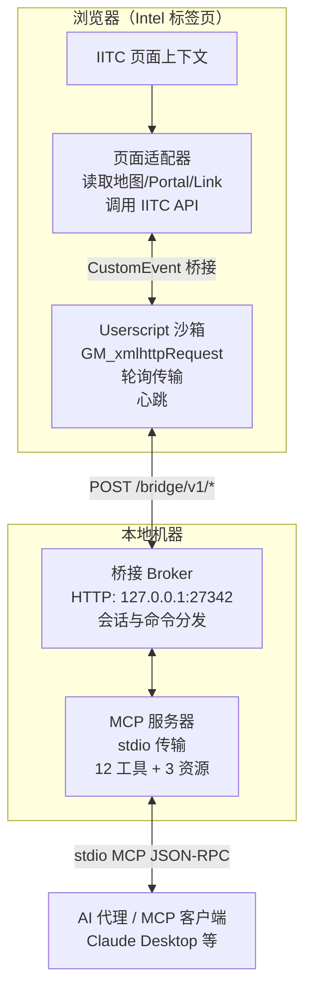

# IITC MCP

**[English](README.md)** | **[中文](README_zh.md)**

将 [IITC（Ingress Intel Total Conversion）](https://github.com/IITC-CE/ingress-intel-total-conversion) 浏览器标签页暴露为 [MCP（Model Context Protocol）](https://modelcontextprotocol.io/) 服务器的双模块桥接工具。AI 代理和 MCP 兼容客户端可以读取地图状态、导航视口、搜索 Portal、收发 COMM、兑换 passcode——全部通过本地回环桥接完成。

## 快速开始

### 1. 安装 Userscript

先装好 [IITC](https://iitc.app/)，然后用 Tampermonkey 安装 iitc-mcp 脚本：

```
https://github.com/comicchang/iitc-mcp/releases/latest/download/iitc-mcp.user.js
```

### 2. 给 Agent 配置 MCP Server

CLI 入口：

```bash
npx github:comicchang/iitc-mcp serve
```

**Codex**（`~/.codex/config.toml` 或项目级 `.codex/config.toml`）：

```toml
[mcp_servers.iitc-mcp]
command = "npx"
args = ["github:comicchang/iitc-mcp", "serve"]
```

**OpenCode**（`~/.openCode/mcp.json` 或项目级 `.openCode/mcp.json`）：

```json
{
  "mcpServers": {
    "iitc-mcp": {
      "command": "npx",
      "args": ["github:comicchang/iitc-mcp", "serve"]
    }
  }
}
```


<details>
<summary>Oh My Pi 本地开发配置</summary>

```json
"iitc-mcp": {
  "type": "stdio",
  "command": "/path/to/node_modules/.bin/tsx",
  "args": ["/path/to/packages/mcp-server/src/cli.ts", "serve"]
}
```

</details>

重载 MCP 配置即可使用，16 个工具自动注册。

打开 [https://intel.ingress.com](https://intel.ingress.com)，Userscript + MCP Server 都就绪后，IITC Toolbox 里 `MCP` 状态灯变绿即连接成功。

## 架构

项目由三个包组成，职责清晰分离：浏览器 userscript 通过 `127.0.0.1` HTTP 与本地 Node.js MCP 服务器通信，服务器通过标准 stdio MCP 接口暴露给 AI 代理。



### 包结构

- **`packages/protocol`** — 桥接线协议的共享 Zod schema 和 TypeScript 类型，包括 DTO 和错误码
- **`packages/iitc-plugin`** — Tampermonkey userscript：页面适配器（IITC 页面上下文）+ 沙箱传输层
- **`packages/mcp-server`** — Node.js MCP 服务器：桥接 Broker、HTTP 服务器和 MCP 工具/资源注册

桥接协议是基于 `POST` 到 `127.0.0.1` 的半双工拉取式 RPC，专为 `GM_xmlhttpRequest` 约束设计。所有响应携带 `Content-Type: application/json; charset=utf-8` 和 `Cache-Control: no-store`。

## 环境要求

- **Node.js** >= 20.19
- **Tampermonkey**（或兼容的 userscript 管理器），Chrome 或 Firefox
- 可访问 `https://intel.ingress.com` 的浏览器


## 工具

| 工具 | 类别 | 说明 |
|------|------|------|
| `iitc_get_map_state` | 只读 | 获取当前地图中心、缩放、边界、选中 Portal 和数据状态 |
| `iitc_set_map_view` | UI | 设置地图视图到指定经纬度和缩放；等待 `moveend` |
| `iitc_fit_map_bounds` | UI | 将地图适配到指定边界框（南/西/北/东）；等待 `moveend` |
| `iitc_list_portals` | 只读 | 列出当前视口中的 Portal（分页，仅 IITC 缓存） |
| `iitc_list_links` | 只读 | 列出当前视口中的 Link（分页，仅 IITC 缓存） |
| `iitc_list_fields` | 只读 | 列出当前视口中的控制场（分页，仅 IITC 缓存） |
| `iitc_get_portal_details` | 只读 | 按 GUID 获取 Portal 详情：mod、共振器、所有者、历史、关联实体 |
| `iitc_select_portal` | UI | 在地图上选择 Portal；显示侧边栏详情 |
| `iitc_search` | 只读 | 通过 IITC 搜索功能搜索 Portal/地点（带静默窗口启发式） |
| `iitc_list_comm` | 只读 | 列出指定频道的 COMM 消息（`all`、`faction`、`alerts`）；可选刷新 |
| `iitc_send_comm` | **副作用** | 向 `all` 或 `faction` COMM 频道发送消息 |
| `iitc_redeem_code` | **副作用** | 提交 Ingress passcode 进行兑换（一次性，奖励物品/AP/XM） |
## 编译调试

```bash
git clone https://github.com/comicchang/iitc-mcp.git
cd iitc-mcp
npm ci --legacy-peer-deps
npm run build && npm test        # 61 tests, typecheck, 3 build artifacts
```

构建脚本使用 esbuild 产出三个制品：
1. **Userscript 包** (`dist/iitc-mcp.user.js`) — 页面适配器 + page-entry 打包为 IIFE
2. **元数据文件** (`dist/iitc-mcp.meta.js`) — `@updateURL`/`@downloadURL` 元数据
3. **服务器入口** (`dist/server/cli.mjs`) — 打包后的 Node.js ESM 入口

日常开发命令：

```bash
npm run typecheck    # strict TypeScript
npm run build        # userscript + server
npm run lint         # ESLint
npm test             # unit tests (61)
npm run test:smoke   # no-browser smoke tests

# 本地启动 MCP server
npx tsx packages/mcp-server/src/cli.ts serve
```
### "SESSION_CONFLICT" 错误

- 只有一个 Intel 标签页可以持有活跃的桥接会话
- 关闭另一个 Intel 标签页，或等待 45 秒让旧会话租约过期
- 租约清除后第二个标签页会自动连接


### 连接超时或网络错误
- 确认服务器绑定到 `127.0.0.1`（不是 `localhost`——某些系统将 `localhost` 解析为 `::1`，服务器不在该地址监听）
- 检查是否有其他进程占用端口 27342：`lsof -i :27342`
- 尝试自定义端口：`node dist/server/cli.mjs serve --bridge-port 12345`
- 检查防火墙或安全软件是否阻止 localhost 连接

### 插件未出现在 Tampermonkey 菜单中

- 确认 userscript 匹配 `https://intel.ingress.com/*`——在 Tampermonkey 编辑器中检查 `@match` 指令
- 确保 Tampermonkey 已启用（图标不应为灰色）
- 尝试在 Tampermonkey 控制面板中禁用并重新启用脚本

## 安全模型

- **仅回环**：HTTP 桥接仅绑定 `127.0.0.1`，无外部网络访问，无需 token 认证
- **CSP 合规**：页面适配器使用兼容 Intel `script-src` CSP 的内联 `<script>` 标签注入模式，不使用 `eval`、`onclick` 或 `unsafeWindow` 绕过
- **单标签页**：只有一个 Intel 标签页可以持有活跃会话，第二个标签页收到 HTTP 409
- **无数据泄露**：所有通信保留在本地机器上，不向外部服务器发送数据
- **COMM 和 passcode**：passcode 和 COMM 文本仅保留在浏览器内存中——它们由 IITC 发送到 Niantic 服务器，但从不本地存储或发送给 MCP 客户端（除非工具明确返回）

## 构建

```bash
npm ci              # 安装依赖
npm run typecheck   # TypeScript 严格模式编译检查 (tsc -b)
npm run build       # typecheck + esbuild 打包
npm run lint        # ESLint 检查所有包、测试和脚本
```

构建脚本使用 esbuild 产出三个制品：
1. **Userscript 包** (`dist/iitc-mcp.user.js`) — 页面适配器 + page-entry 打包为 IIFE，由沙箱层注入，沙箱层本身也被打包到最终 userscript 中
2. **元数据文件** (`dist/iitc-mcp.meta.js`) — 独立的 `@updateURL`/`@downloadURL` 元数据
3. **服务器入口** (`dist/server/cli.mjs`) — 打包后的 Node.js ESM 入口

## 测试

```bash
npm test             # 单元测试 (Vitest) — 所有包共 161 个测试
npm run test:modules # 集成测试 (Playwright) — 浏览器 + 真实 CLI 子进程
npm run test:smoke   # 冒烟测试 — 无浏览器断开状态、NOT_READY 错误
```

### 测试架构

- **单元测试** (`packages/*/test/`) — 使用 Vitest，配合伪 IITC 全局变量、伪 `GM_*` API、伪计时器和临时端口，零真实网络访问
- **模块测试** (`npm run test:modules`) — Playwright Chromium + Firefox，通过 GM shim 加载真实 userscript 包、临时桥接服务器和 MCP `StdioClientTransport` 驱动真实 CLI 子进程
- **冒烟测试** (`test/smoke/`) — 快速断言：无浏览器 → `iitc://status` 显示断开，所有 IITC 工具返回 `NOT_READY`

所有测试均不需要真实 Intel 凭据或到 Niantic 服务器的网络访问。

## 许可证

[MIT](https://opensource.org/licenses/MIT)
